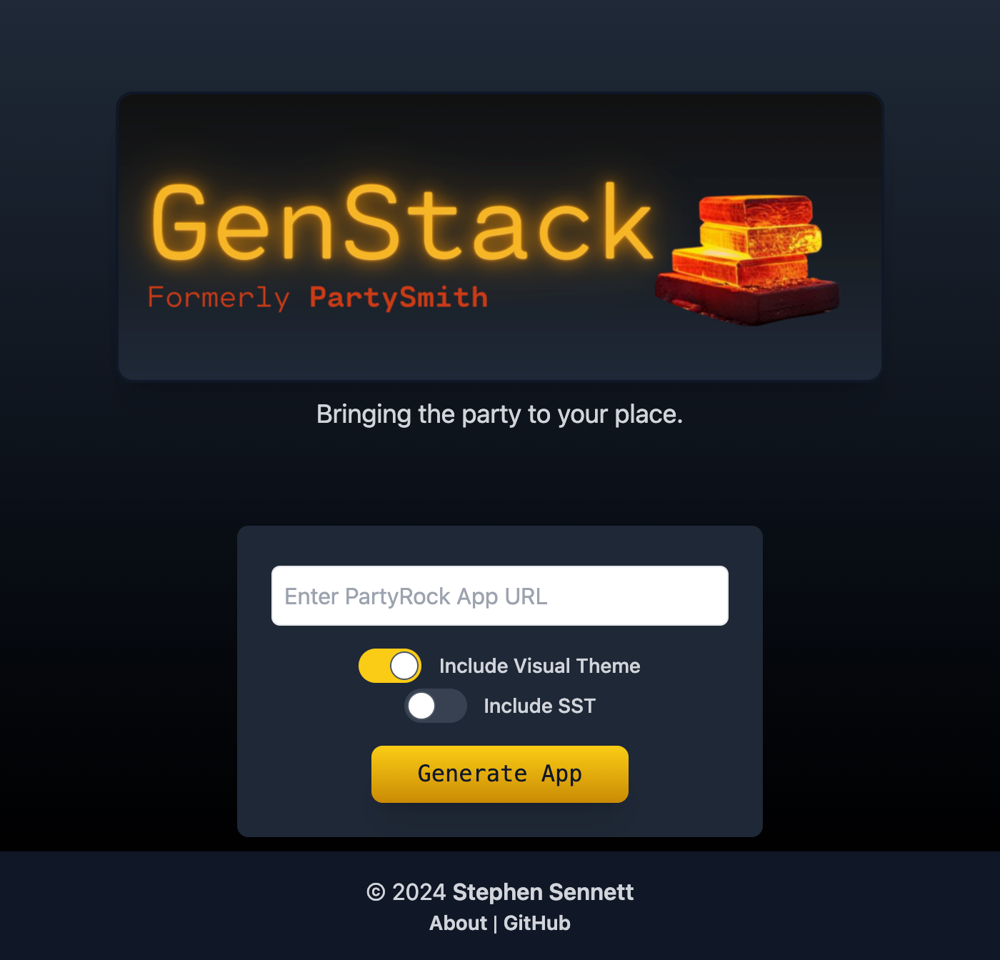

# GenStack

GenStack transforms your AWS PartyRock apps into deployable full-stack SvelteKit applications.

Users can enter the URL of a publicly published PartyRock app, select the desired settings, and GenStack will forge an application into a ZIP archive which will be downloaded to your machine, and ready for use.

This is an unofficial community project, and not directly affiliated with Amazon Web Services.

## Usage

You can use GenStack either by going to the production site at [genstack.ssennett.net](https://genstack.ssennett.net/), or by cloning this repo and running the application yourself.



After opening the web app, you simply input the desired settings, and the ZIP archive will be downloaded to your browser. Details on how to run the generated apps can be found in the [README](templates/primary/README.md) built-in to the app.

Try a [demo](https://demo.partysmith.ssennett.net/) based on the [Costume Theme Designer](https://partyrock.aws/u/nadino/xEljGaHQr/Costume-Theme-Designer/snapshot/VRuSGss6V) PartyRock app by AWS Community Builder [Nadia Reyhani](https://www.linkedin.com/in/ronak-reyhani).

## Deploying GenStack Itself

If you'd like to run this app itself, you can clone the repo to your own machine, install the necessary packages, and run it locally in development mode.

```bash
git clone https://github.com/ssennettau/genstack.git
cd genstack
npm install
npm run dev
```

You can also deploy it to your own choice of hosting. By default, this application is deployed with SST, and can either by deployed directly using it, or by building the package and deploying it manually.

```bash
npx sst deploy --stage dev

npm run build
```

To deploy it to another hosting platform like Vercel, the adaptor in `svelte.config.js` would need to be updated accordingly.

## How does it work?

GenStack relies on a number of templated layers which are provided in the downloads, and are made to be highly general-purpose, so it will be compatible with any PartyRock application (intended, no guarantee).

Along with these layers, the app is customized using the definition of the application downloaded from PartyRock itself, which exists in the form of a JSON file. That JSON file is added to the templates, and is used at run-time to render the app, and all of its calls out to Amazon Bedrock.

The role of templates are futher described in the [templates README](templates/README.md).

